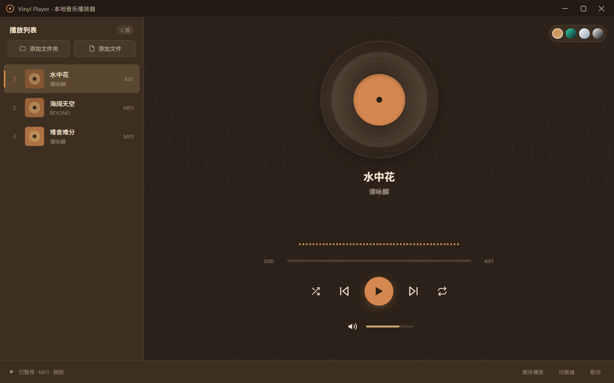
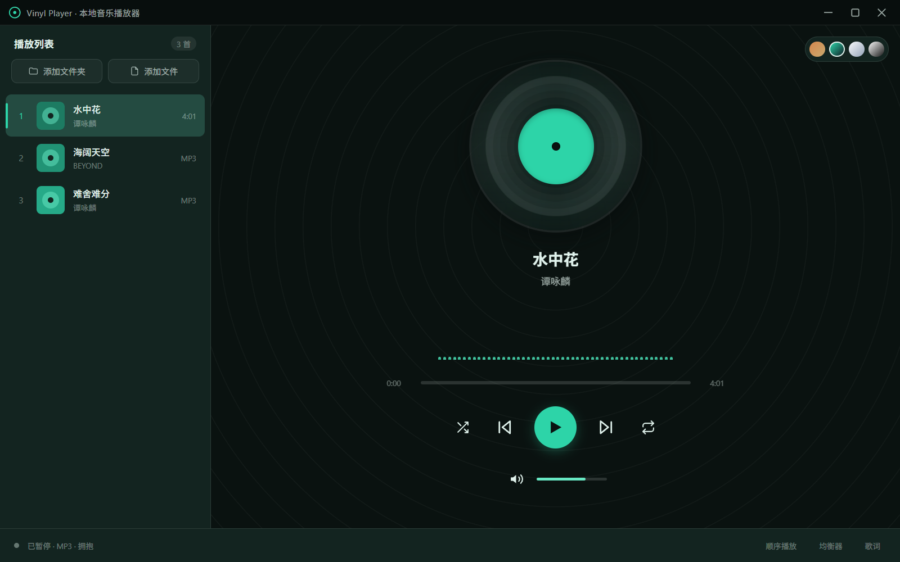
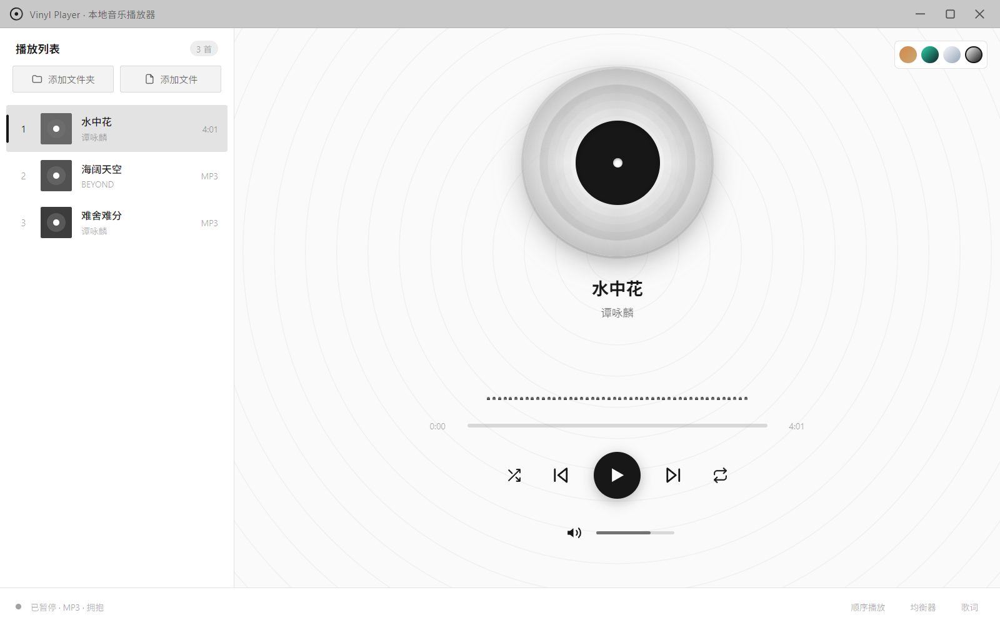
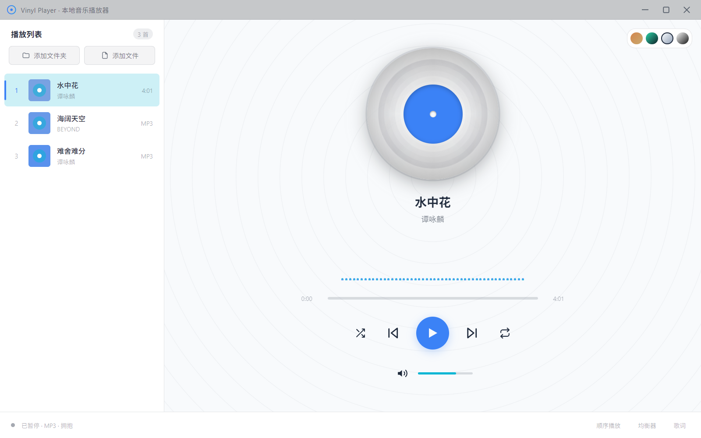

# Vinyl Player 黑胶播放器

[English](./README.md) | **中文**

一款基于 [Wails](https://wails.io/) 构建的桌面音频播放器，后端使用 Go，前端使用 Vue 3。它拥有黑胶唱片风格的界面、内置均衡器、频谱可视化以及同步歌词，本地音乐文件即开即听。

## ✨ 功能特性

- 🎵 **多格式支持**：MP3、FLAC、WAV、M4A、OGG（由 WebView2 原生解码）
- 🏷️ **自动读取元数据**：解析音频内嵌的标题、艺术家、专辑与封面图
- 🎚️ **6 段均衡器**：内置平坦、流行、摇滚、爵士、古典、重低音、人声等预设，支持自定义增益
- 📊 **实时频谱可视化**：基于 Web Audio API 的动态音频频谱
- 📜 **同步歌词**：自动加载与音频同名的 `.lrc` 歌词文件并随播放高亮
- 🎨 **多主题切换**：复古怀旧 / 深色沉浸 / 浅色简洁 / 极简现代
- 🔀 **播放控制**：随机播放、单曲/列表循环、音量调节、进度拖拽
- 📁 **本地媒体库**：可导入文件夹或多个文件，媒体库自动持久化，重启后恢复
- 🖼️ **无边框窗口**：自定义标题栏与窗口控制

## 📸 界面预览

<table>
  <tr>
    <td align="center">
      <br/>
      <sub>复古怀旧</sub>
    </td>
    <td align="center">
      <br/>
      <sub>深色沉浸</sub>
    </td>
  </tr>
  <tr>
    <td align="center">
      <br/>
      <sub>浅色现代</sub>
    </td>
    <td align="center">
      <br/>
      <sub>浅色简洁</sub>
    </td>
  </tr>
</table>

## 🏗️ 技术架构

| 层次 | 技术 |
| --- | --- |
| 桌面框架 | Wails v2 |
| 后端 | Go 1.25 |
| 前端 | Vue 3 + Vite |
| 元数据解析 | [dhowden/tag](https://github.com/dhowden/tag) |
| 音频处理 | Web Audio API（均衡器 + 频谱） |

后端核心模块：

- `main.go` — 应用入口，配置 Wails 窗口并启动媒体服务
- `app.go` — 绑定到前端的应用逻辑（媒体库加载、文件选择、窗口控制）
- `library.go` — 音乐库管理，扫描文件、提取元数据、生成 Track
- `mediaserver.go` — 独立的本地回环 HTTP 服务，通过 Range 请求流式提供音频、封面与歌词
- `store.go` — 媒体库持久化（保存至 `%AppData%/VinylPlayer/library.json`）

> 说明：媒体资源运行在独立的 loopback 端口上（而非 Wails 资源服务器），以确保在 `wails dev` 与生产构建中流式播放与拖动进度都能正常工作。

## 🚀 快速开始

### 环境要求

- [Go](https://go.dev/) 1.25+
- [Node.js](https://nodejs.org/)（含 npm）
- [Wails CLI](https://wails.io/docs/gettingstarted/installation)：`go install github.com/wailsapp/wails/v2/cmd/wails@latest`
- Windows 需安装 WebView2 运行时（Win10/11 通常已内置）

### 开发模式

在项目根目录运行，支持前端热重载：

```bash
wails dev
```

如需在浏览器中调试并调用 Go 方法，可访问 http://localhost:34115。

### 构建发布

生成可分发的生产版本：

```bash
wails build
```

产物为 `VinylPlayer.exe`。

## 📖 使用说明

1. 首次启动会自动加载随附的 `audios/` 示例曲目。
2. 通过界面导入本地音乐文件夹或单个/多个音频文件，媒体库会自动保存。
3. 将 `.lrc` 歌词文件与音频文件放在同一目录且同名，即可自动加载同步歌词。
4. 在均衡器面板选择预设或手动调节 6 段增益。
5. 通过主题切换器随时更换界面风格。

## 📂 项目结构

```
VinylPlayer/
├── app.go              # 前端绑定的应用逻辑
├── main.go             # 应用入口
├── library.go          # 音乐库与元数据解析
├── mediaserver.go      # 本地媒体流服务
├── store.go            # 媒体库持久化
├── audios/             # 示例音频
└── frontend/           # Vue 3 前端
    └── src/
        ├── components/     # 界面组件（播放器、歌词、均衡器等）
        └── composables/    # 播放逻辑与主题（usePlayer / useTheme）
```

## 📄 配置

可通过编辑 `wails.json` 调整项目设置，详见 [Wails 项目配置文档](https://wails.io/docs/reference/project-config)。

## 支持项目

如果这个项目对你有帮助，欢迎请我喝杯咖啡 ☕

<table>
  <tr>
    <td>
      
    </td>
    <td width="100" align="center" > 🙏 </td>
    <td>
      
    </td>
  </tr>
</table>